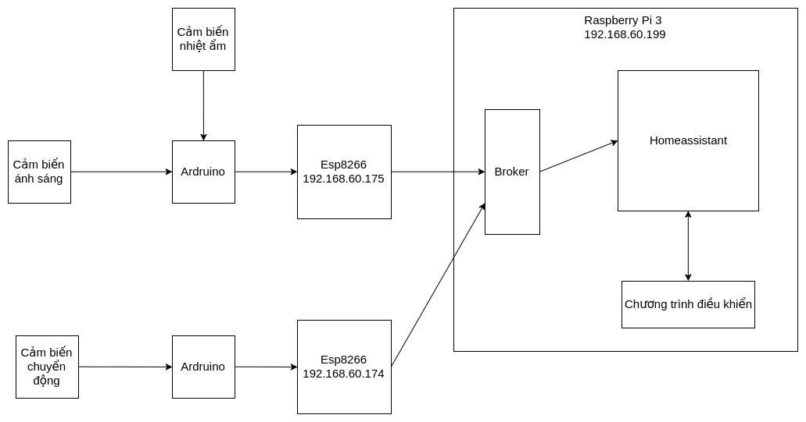

# Cài đặt Homeassistant và kịch bản demo

## Kịch bản cài đặt 

Hệ thống gồm có: 

- Cảm biển chuyển động
- Cảm biến nhiệt ẩm
- Cảm biến ánh sáng
- 3 đèn Led: xanh, đỏ, vàng
- Raspbery pi 3 cài Homeassistant 
- Arduino, esp8266
- Chương trình điều khiển thực hiện 1 kịch bản trong thực tế

Các cảm biến sẽ được cắm trên arduino để thu thập dữ liệu và publish lên một broker thông qua mạng Wifi (kết nối qua Esp8266). Broker này được deploy trên Raspbery. Homeassistant sẽ subscribe vào các topic của broker để có thể lấy được dữ liệu mà Arduino gửi lên. Chương trình điều khiển sẽ sử dụng api mà Homeassistant cung cấp để có thể lấy và đặt trạng thái cho các thiết bị

Kịch bản sử dụng: Khi có cảm biến chuyển động phát hiện người thì tùy vào tình trạng ánh sáng mà cảm biến ánh sáng thu thập được mà ra lệnh bật đèn xanh (ánh sáng mạnh), đỏ (ánh sáng vừa) hay vàng (ánh sáng ít hoặc không)

## Sơ đồ cơ bản hệ thống

 

## Cài đặt 

### Cài đặt Broker

Ta sử dụng docker để chạy một container mosquitto bằng lệnh: 

~~~
docker run -itd --name mosquitto -p 1883:1883 haiquan5396/mqtt 
~~~
### Cấu hình Homeassistant 

Để cấu hình Homeassistant ta phải thay đổi file `configuration.yaml`. File có nhiều thành phần nhưng ta quan tâm chủ yếu tới các phần sau: 

#### Cấu hình broker: 

~~~
mqtt:
  broker: 192.168.60.199
~~~

Ở đây ta chỉ cần đưa ra địa chỉ của broker đã deploy

#### Cấu hình các đèn Led:

~~~
light:
  - platform: mqtt
    name: "Green Light"
    state_topic: 'light/status'
    command_topic: 'zone_1/box_1/led'
    payload_on: '{"name":"Green Light",
                  "value":"ON"}'
    payload_off: '{"name":"Green Light",
                   "value":"OFF"}'

  - platform: mqtt
    name: "Red Light"
    state_topic: 'light/status'
    command_topic: 'zone_1/box_1/led'
    payload_on: '{"name":"Red Light",
                  "value":"ON"}'
    payload_off: '{"name":"Red Light",
                   "value":"OFF"}'
  - platform: mqtt
    name: "Yellow Light"
    state_topic: 'light/status'
    command_topic: 'zone_1/box_1/led'
    payload_on: '{"name":"Yellow Light",
                  "value":"ON"}'
    payload_off: '{"name":"Yellow Light",
                   "value":"OFF"}'
~~~

Các light sẽ sử dụng broker với topic tương ứng (topic quy định tại `state_topic`) để có thể lấy dữ liệu tương ứng của mình. Dữ liệu gửi lên sẽ có dạng JSON: `{"name": "Tên đèn", "value": "giá trị"}`

Khi có sự kiện thay đổi trạng thái của đèn thì các `light` sẽ gửi vào `command_topic` dữ liệu `{"name": "Tên đèn", "value": "giá trị cần thay đổi"}` để đi xuống phía Arduino nhằm thay đổi trạng thái của các thiết bị vật lý. Khi các thiết bị vật lý được thay đổi trạng thái thì Arduino phải gửi lại để cập nhật trạng thái hiển thị trong Homeassistant thông qua `state_topic`

#### Cấu hình cảm biến chuyển động 
~~~
binary_sensor:
  - platform: mqtt
    name: "Motion Detection"
    state_topic: "zone_1/box_1/motion/id_1"
    device_class: motion
    value_template: '{{ value_json.motion }}'
    payload_on: "1"
    payload_off: "0"
~~~

Các cảm biến chuyển động cũng sẽ lấy dữ liệu thông qua broker tại topic `state_topic`. Do dữ liệu gửi lên có dạng `{"motion": "giá trị"}` nên ta phải bóc tách dữ liệu nhờ `value_template: '{{ value_json.motion }}'`. Nếu nhận được giá trị là 1 sẽ tương ứng với có chuyển động và nếu nhận được giá trị là 0 tức là không có chuyển động

#### Cấu hình cảm biến nhiệt ẩm và cảm biến ánh sáng

~~~
sensor:

  - platform: mqtt
    name: "Temperature"
    # state_topic: "temperature/status"
    state_topic: "zone_1/box_1/light/id_1"
    unit_of_measurement: '°C'
    value_template: '{{ value_json.temperature }}'
  - platform: mqtt
    name: "Humidity"
    state_topic: "zone_1/box_1/light/id_1"
    value_template: '{{ value_json.humidity }}'
    unit_of_measurement: '%'
  - platform: mqtt
    name: "Light"
    state_topic: "zone_1/box_1/light/id_1"
    value_template: '{{ value_json.light }}'
~~~

Các cảm biến này đều lấy dữ liệu từ broker. Các dữ liệu gửi lên đều có dạng JSON nên phải bóc tách bằng `value_template`

Dữ liệu gửi lên của cảm biến nhiệt ẩm: `{"humidity":"độ ẩm", "temperature":"nhiệt độ"}`
Dữ liệu gửi lên của cảm biến ánh sáng: `{"light": "giá trị"}` (giá trị thuộc tập: {0, 1, 2} )

#### Cấu hình dữ liệu gửi đi từ Homeassistant lên chương trình điều khiển

Với chiều từ Homeassistant lên chương trình điều khiển sẽ viết, ta chỉ gửi khi có chuyển động. Để làm điều đó ta thêm vào dòng cấu hình: 

~~~
automation:
  - alias: "Detection Automation"
    trigger:
      platform: state
      entity_id: binary_sensor.motion_detection
      from: "off"
      to: "on"

    action:
      - service: mqtt.publish
        data_template:
          topic: "motion/have_human"
          payload: "Have Human"

~~~

Mỗi khi cảm biến chuyển động trong Homeassistant có trạng thái chuyển từ on sang off hay từ không có người sang có người thì ta sẽ publish một thông báo `Have Human` lên topic `motion/have_human` 

## Cài đặt chương trình điều khiển 

Ta sử dụng thư viện `paho` để kết nối đến broker và api của Homeassistant để get và set các state. Ở đây ta sử dụng python api của Homeassistant để viết chương trình điều khiển 

~~~

import paho.mqtt.client as mqtt
import homeassistant.remote as remote

api = remote.API('127.0.0.1')

def on_connect(client, userdata, flags, rc):
    if rc == 0:
        print("Connected to broker")
    else:
        print("Connection failed")

def on_message(client, userdata, msg):

    if (msg.payload.decode('utf-8') == 'Have Human'):
        print ('Have human in room')
        light_sensor = remote.get_state(api, 'sensor.light')
        temp = int(light_sensor.state)
        if(temp == 0 ):
            print ('Anh Sang 0 : Den Vang')
            control_light('turn_off', 'turn_off', 'turn_on')

        elif (temp == 1):
            print ('Anh Sang 1 : Den Do')
            control_light('turn_off', 'turn_on', 'turn_off')

        else:
            print ('Anh Sang 2 : Den Xanh')
            control_light('turn_on', 'turn_off', 'turn_off')

    else:
         print ('Error Message')

def control_light(green, red, yellow):

    domain = 'light'
    remote.call_service(api, domain, green, {"entity_id": "light.green_light"})
    remote.call_service(api, domain, red, {"entity_id": "light.red_light"})
    remote.call_service(api, domain, yellow, {"entity_id": "light.yellow_light"})

client = mqtt.Client()
client.on_connect = on_connect
client.on_message = on_message

client.connect("192.168.60.199", 1883)
client.subscribe("motion/have_human")
client.loop_forever()

~~~

Hàm `on_message(client, userdata, msg)` để xử lý dữ liệu khi nhận được trên topic đã subcribe là `motion/have_human`

Hàm `control_light(green, red, yellow)` để điều khiển gọi các service bật tắt các đèn tương ứng